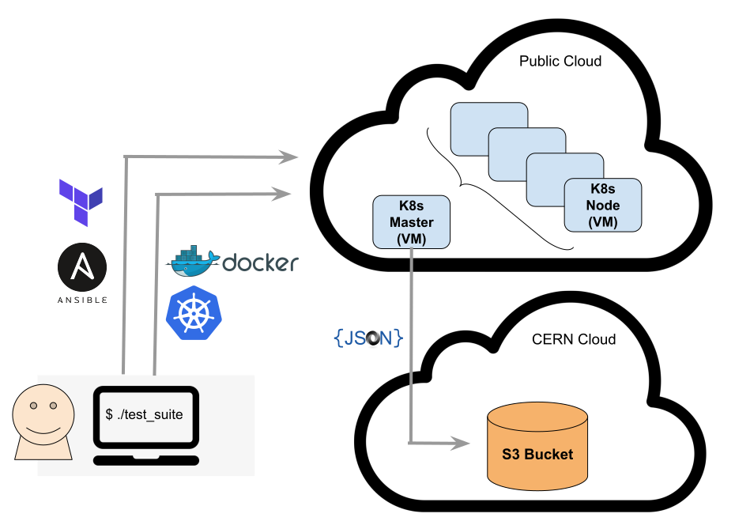

Projects
---------------------------------------------

This page contains project specific information concerning the test suite.

Open Clouds for Research Environments (OCRE)
====================================================

Motivation
^^^^^^^^^^^^^^^^^^^^

The test-suite is intended to be used to test and validate cloud services across the stack for research and education environments. The development of the test suite originates from the HNSciCloud project, where automation was lacking as tests deployments were executed manually, in a scattered manner with no result tracking capabilities.
This Test-Suite is being used as a validation tool for cloud services procurement in European Commission sponsored projects such as OCRE and ARCHIVER.
The testing and validation in the scope of OCRE will be used as part of the selection criteria  for the adoption funds available in the project, resulting in a OCRE certification process for the 27 platforms involved in the project.

Below, an overview of the tool and overall test validation in the context of the OCRE project.

Scope of the Testing and Validation
^^^^^^^^^^^^^^^^^^^^^^^^^^^^^^^^^^^^^^^^^^^^^^^^

The test suite is capable of evaluating different services across the cloud stacks:

- **Networking** - Network performance tests using |perfSONAR_link|.

- **Standard CPU benchmarks** - Runs of a set of |cpu_bmk_suite| to benchmark CPU performance.

- **Basic S3 storage features validation** - Check the availability of the main S3 object store functionalities.

- **Basic Data Repatriation** - Tests data backup exports from the cloud provider to the |zenodo_link| repository service.

- **Machine Learning** - Set of benchmarks for single and multiple node algorithm training of advanced GAN models (|nnlo_link|, |progan_link| and |3dgan_link|), on accelerator architectures (i.e. GPUs).

- **DODAS check** - |dodas_link| is a scientific software framework running a test workload from one of the LHC experiments, |cms_link|. Success running this test indicates the DODAS framework can generate clusters on demand using public cloud, for batch workload execution based on the |htcondor_link| workload management system.

.. |perfSONAR_link| raw:: html

  <a href="https://www.perfsonar.net/" target="_blank">perfSONAR</a>

.. |cpu_bmk_suite| raw:: html

  <a href="https://gitlab.cern.ch/hep-benchmarks" target="_blank">High Energy Physics (HEP) specific workloads</a>

.. |dodas_link| raw:: html

  <a href="https://dodas-ts.github.io/dodas-doc/introduction/" target="_blank">DODAS</a>

.. |cms_link| raw:: html

  <a href="https://cms.cern/" target="_blank">CMS</a>

.. |htcondor_link| raw:: html

  <a href="https://research.cs.wisc.edu/htcondor/" target="_blank">HTCondor</a>

.. |zenodo_link| raw:: html

  <a href="https://zenodo.org/" target="_blank">Zenodo</a>

.. |nnlo_link| raw:: html

  <a href="https://github.com/vlimant/NNLO" target="_blank">NNLO</a>

.. |progan_link| raw:: html

  <a href="https://github.com/svalleco/CProGAN-ME" target="_blank">ProGAN</a>

.. |3dgan_link| raw:: html

  <a href="https://github.com/recardoso/ISC_HPC_3DGAN/" target="_blank">3DGAN</a>

The |tc_link| provides additional details about these tests.

**The testing and validation in the scope of OCRE will be used as part of the selection criteria  for the adoption funds available in the project.**

Results
^^^^^^^^^^^^

Results of the runs will be stored as JSON files on an S3 bucket on the CERN cloud's CEPH service. OCRE consortium members will be able to access all results, whilst vendors only their own results.

To provide segregated access, pre-signed S3 URLs will be used. Each vendor will be provided a list of pre-signed URLs that should be used to obtain the result files.
Automation of the download of those result files is possible. Please use |results_download_tool_link| to do it.

The CERN development team is developing a dashboard that will parse the data from the JSON files, for a more user-friendly visualisation.

**No tests results will be made public without agreement of the respective vendor.**

The OCRE consortium aims to create a certification process for the platforms that are successfully validated. This process will be agreed and communicated to the respective vendors before being put in place.

In addition to the GÉANT contract management team, two CERN members shall be involved in the interactions:

- A CERN representative will handle all communication between the vendors technical representatives and the CERN developers.

- A CERN technical representative will be responsible for deploying and performing validation tests. In addition, he must have permissions to create additional local user accounts in the award subscription, in case other members need access to run or complete those tests.

.. |results_download_tool_link| raw:: html

  <a href="https://github.com/cern-it-efp/ts-results-download" target="_blank">this tool</a>

Requirements
^^^^^^^^^^^^^^^^^^

In order to perform multiple runs of the test set including the Machine Learning benchmarks, an modest subscription credit (**5000€**, valid for 6 months) is required for the full stack of services available in the platforms.

In case a platform does not offer accelerator architectures (i.e. GPUs, FPGAs or similar vendor specific) the required amount of credits can be lower.

The number/type of tests is expected to evolve during 2021 in areas such as HPCaaS. Any new additional test will be documented and this page updated. It shall not imply requests of additional credit.

Timeline
^^^^^^^^^^^^
Access to the platforms should be provided to the testing team by the latest in mid April 2021. Results will start to be available between May and June 2021.

Main Technical Contacts
^^^^^^^^^^^^^^^^^^^^^^^^^^^^^^

To handle communication effectively, please use the mailing list: cloud-test-suite AT cern.ch

The contact details of the CERN technical representative that will be responsible for deploying and performing validation tests will be provided later.

Licensing
^^^^^^^^^^^^^^

The framework is licensed under |license_link|. Tests included might have their specific licenses.
For more details, please refer to the |tc_link|.

.. |tc_link| raw:: html

  <a href="https://eosc-testsuite.readthedocs.io/en/latest/testsCatalog.html" target="_blank">Tests Catalog</a>

.. |license_link| raw:: html

  <a href="https://github.com/cern-it-efp/EOSC-Testsuite/blob/master/LICENSE" target="_blank">AGPL</a>

Resources
^^^^^^^^^^^^^^

- |repo_link|
- |docs_link|

.. |repo_link| raw:: html

  <a href="https://github.com/cern-it-efp/EOSC-Testsuite/" target="_blank">Repository</a>

.. |docs_link| raw:: html

  <a href="https://eosc-testsuite.readthedocs.io/en/latest/" target="_blank">Documentation</a>
